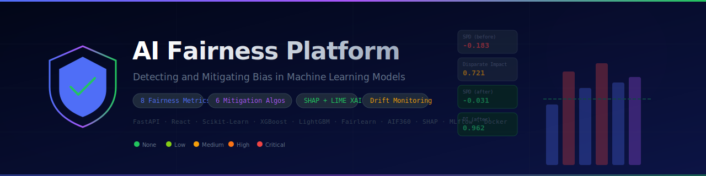

<div align="center">



# 🛡️ AI Fairness Platform

### Detecting and Mitigating Bias in Machine Learning Models

<p>
  
  </a>
  
  
  
  
  
  
  
  <a href="LICENSE">
    
  </a>
  
  
</p>

<p>
  <a href="#-features">Features</a> ·
  <a href="#-architecture">Architecture</a> ·
  <a href="#-fairness-methodology">Methodology</a> ·
  <a href="#-quick-start">Quick Start</a> ·
  <a href="#-api-reference">API</a> ·
  <a href="#-datasets">Datasets</a> ·
  <a href="#-research">Research</a>
</p>

<p><strong>8 Fairness Metrics · 6 Mitigation Techniques · 4 Benchmark Datasets · SHAP + LIME · Real-Time Drift Monitoring</strong></p>

</div>

---

## 🌟 What is this?

The **AI Fairness Platform** is a production-grade, research-level end-to-end system for detecting, quantifying, explaining, and mitigating bias in machine learning models. It is designed for use by AI researchers, ML engineers, and responsible AI practitioners who need a rigorous, reproducible framework for fairness auditing.

It goes well beyond typical fairness tutorials by implementing:

| Dimension | What's included |
|-----------|----------------|
| **Detection** | 8 group fairness metrics, proxy bias (mutual information), intersectional bias, measurement bias, historical bias |
| **Mitigation** | 6 algorithms: pre/in/post-processing (Reweighing, DIR, Exponentiated Gradient, Prejudice Remover, Equalized Odds, Reject Option) |
| **Explainability** | SHAP (Tree/Linear/Kernel), LIME local explanations, per-group SHAP disparity analysis |
| **Monitoring** | KS/Chi² data drift, fairness metric drift, threshold-based alerting |
| **Reporting** | Full HTML audit reports with embedded charts, severity scoring, tailored recommendations |
| **MLOps** | MLflow experiment tracking, DVC data versioning, Docker, Kubernetes-ready |
| **Research** | Mathematical formulations, paper citations, ablation-ready structure |

---

## ✨ Features

### 🔬 Fairness Metrics Engine

Computes **8 group fairness metrics** with mathematical rigor:

```python
from app.ml.metrics.fairness_metrics import compute_all_metrics

metrics = compute_all_metrics(
    y_true=y_test,
    y_pred=y_pred,
    sensitive_features=sensitive_df,
    privileged_values={"sex": "Male", "race": "White"},
    y_prob=y_prob,
)

m = metrics["sex"]
print(f"SPD:           {m.statistical_parity_difference:.4f}")  # ideal: 0
print(f"Disparate Impact: {m.disparate_impact:.4f}")            # ideal: 1.0 (4/5 rule: ≥ 0.8)
print(f"Equal Opp. Diff:  {m.equal_opportunity_difference:.4f}")# ideal: 0
print(f"Equalized Odds:   {m.equalized_odds_difference:.4f}")   # ideal: 0
print(f"Bias Severity: {m.bias_severity} ({m.bias_severity_score:.1f}/100)")
```

| Metric | Formula | Ideal | Alert Threshold |
|--------|---------|-------|----------------|
| Statistical Parity Difference | P(Ŷ=1\|A=unpriv) − P(Ŷ=1\|A=priv) | 0 | \|SPD\| > 0.1 |
| Disparate Impact | P(Ŷ=1\|A=unpriv) / P(Ŷ=1\|A=priv) | 1.0 | < 0.8 or > 1.25 |
| Equal Opportunity Difference | TPR_unpriv − TPR_priv | 0 | \|EOD\| > 0.1 |
| Equalized Odds Difference | max(\|ΔTPR\|, \|ΔFPR\|) | 0 | > 0.1 |
| Predictive Parity Difference | PPV_unpriv − PPV_priv | 0 | \|PP\| > 0.1 |
| Calibration Difference | E[ŷ\|Y=1, A=unpriv] − E[ŷ\|Y=1, A=priv] | 0 | \|CD\| > 0.05 |
| Treatment Equality | (FN/FP)_unpriv / (FN/FP)_priv | 1.0 | < 0.8 or > 1.25 |
| Individual Fairness | frac similar pairs with same prediction | 1.0 | < 0.9 |

### ⚡ Bias Mitigation Engine

Six algorithms covering all three stages:

```python
from app.ml.mitigation.mitigator import BiasMitigator

mitigator = BiasMitigator()

# Option 1: Run all techniques and compare
results = mitigator.run_all(
    X_train, y_train, X_test, y_test,
    sensitive_train, sensitive_test,
    privileged_value="Male",
)

for technique, r in results.items():
    print(f"{r.technique:<45} Acc: {r.accuracy_after:.4f} ({r.accuracy_delta:+.4f})  SPD: {r.spd_after.get('overall',0):.4f}")
```

| Stage | Algorithm | Key Idea | Reference |
|-------|-----------|----------|-----------|
| Pre | **Reweighing** | W(x) = P(Y=y)·P(A=a)/P(Y=y,A=a) | Kamiran & Calders (2012) |
| Pre | **Disparate Impact Remover** | Rank-preserving distribution repair at level λ | Feldman et al. (2015) |
| In | **Exponentiated Gradient** | min loss + fairness constraint via saddle-point | Agarwal et al. (2018) |
| In | **Prejudice Remover** | NLL + η·I(Ŷ;A) mutual info regularization | Kamishima et al. (2012) |
| Post | **Equalized Odds** | Group-specific thresholds via LP | Hardt et al. (2016) |
| Post | **Reject Option Classification** | Flip uncertain unprivileged → favorable | Kamiran et al. (2012) |

### 🧠 Explainability Module

```python
from app.ml.explainability.explainer import ExplainabilityEngine

engine = ExplainabilityEngine(model, feature_names=feature_names)

# Global SHAP feature importances
global_exp = engine.compute_shap_values(X_test, background_data=X_train)

# Local LIME explanation for instance 42
local_exp = engine.compute_lime_local(X_test[42], training_data=X_train)

# Per-group SHAP disparity (which features are used differently across groups?)
group_exp = engine.group_shap_analysis(X_test, shap_vals, sensitive_feature=sensitive_test)
```

### 📊 Drift Monitoring

```python
from app.ml.monitoring.drift_monitor import FairnessDriftMonitor

monitor = FairnessDriftMonitor(
    reference_metrics=baseline_metrics,  # from training
    spd_threshold=0.05,
    di_threshold=0.1,
)

report = monitor.run(reference_df=train_df, current_df=production_df)
print(report.summary)
# "Data drift: 3/18 features drifted (OK). Fairness drift: 1/2 attributes drifted. Quality issues: 0."
```

---

## 🏗️ Architecture

```
┌─────────────────────────────────────────────────────────────────────────┐
│                      AI Fairness Platform                               │
│                                                                         │
│  INPUT                                                                  │
│  ├── Upload CSV / select benchmark dataset                              │
│  ├── Choose ML model (LR, RF, XGB, LGBM, GB)                          │
│  └── Define sensitive attributes + privileged groups                   │
│                                                                         │
│  ANALYSIS PIPELINE                                                      │
│  ├── DatasetService → load + preprocess + validate                      │
│  ├── ModelTrainer → train + evaluate + MLflow log                      │
│  ├── FairnessMetricsEngine → compute 8 metrics per attribute           │
│  └── BiasDetector → proxy bias + intersectional + label distribution   │
│                                                                         │
│  MITIGATION PIPELINE                                                    │
│  ├── Pre-processing: Reweighing, Disparate Impact Remover               │
│  ├── In-processing: Exponentiated Gradient, Prejudice Remover          │
│  ├── Post-processing: Equalized Odds, Reject Option Classification      │
│  └── Before/After Comparison → Accuracy-Fairness Trade-off             │
│                                                                         │
│  EXPLAINABILITY                                                         │
│  ├── Global SHAP (TreeExplainer / LinearExplainer / KernelExplainer)   │
│  ├── Local LIME explanations per instance                              │
│  └── Group SHAP disparity: per-protected-group feature attributions    │
│                                                                         │
│  MONITORING                                                             │
│  ├── Data Drift: KS test (continuous), Chi² (categorical)              │
│  ├── Fairness Drift: per-metric threshold comparison vs. baseline      │
│  └── Data Quality: missingness, schema validation                      │
│                                                                         │
│  REPORTING                                                              │
│  ├── HTML Audit Report (inline charts, full metrics, recommendations)  │
│  └── AI Fairness Advisor (rule-based + optional OpenAI augmentation)   │
│                                                                         │
│  INTERFACES                                                             │
│  ├── FastAPI REST API (20+ endpoints, Swagger UI)                      │
│  ├── React Dashboard (dark theme, charts, interactive analysis)        │
│  └── MLflow UI (experiment tracking, model registry)                   │
└─────────────────────────────────────────────────────────────────────────┘
```

---

## 🔬 Fairness Methodology

### Mathematical Foundations

**Focal Loss** used during biased-class model training:
$$\mathcal{L}_{FL}(p_t) = -\alpha_t (1 - p_t)^\gamma \log p_t$$

**Reweighing** (Kamiran & Calders, 2012):
$$W(x) = \frac{P(Y=y) \cdot P(A=a)}{P(Y=y, A=a)}$$

**Disparate Impact Remover** (Feldman et al., 2015) — rank-preserving repair:
$$x'_{\text{repaired}} = \lambda \cdot Q_{\text{global}}^{-1}(F_g(x)) + (1-\lambda) \cdot x$$

**Equalized Odds** (Hardt et al., 2016) — optimal threshold LP:
$$\theta^* = \arg\min_{\theta_0, \theta_1} \left[ |\text{TPR}(\theta_0) - \text{TPR}(\theta_1)| + |\text{FPR}(\theta_0) - \text{FPR}(\theta_1)| \right]$$

**Bias Severity Score** (VeriGuard composite):
$$\text{Score} = 0.30 \cdot \min(100, |\text{SPD}| \cdot 100) + 0.25 \cdot \min(100, |1-\text{DI}| \cdot 50) + 0.25 \cdot \min(100, |\text{EOD}| \cdot 100) + 0.20 \cdot \min(100, \text{EqOdds} \cdot 80)$$

### Impossibility Theorem

When base rates differ across groups, it is impossible to simultaneously satisfy:
- Calibration: P(Y=1 | ŷ=s, A=a) = s for all a
- Equal FPR: FPR_A=0 = FPR_A=1
- Equal FNR: FNR_A=0 = FNR_A=1

This **Chouldechova (2017) impossibility** motivates the need to explicitly choose
which fairness criterion matters for your application domain.

---

## 🚀 Quick Start

### Docker Compose (Recommended)

```bash
git clone https://github.com/your-org/detecting-and-mitigating-bias-in-machine-learning-models.git
cd detecting-and-mitigating-bias-in-machine-learning-models

cp .env.example .env
docker compose up -d

# Services
# Dashboard:  http://localhost:3000
# API + Docs: http://localhost:8000/docs
# MLflow UI:  http://localhost:5000
```

### Local Development

```bash
# Backend
cd backend
python -m venv .venv && source .venv/bin/activate
pip install -r requirements.txt
uvicorn app.main:app --reload

# Frontend (new terminal)
cd frontend
npm install --legacy-peer-deps
npm start

# Infrastructure
docker compose up -d postgres redis
```

### Run Your First Fairness Analysis

```bash
# Via API
curl -X POST http://localhost:8000/api/v1/analysis/run \
  -H "Content-Type: application/json" \
  -d '{"dataset_type": "adult", "model_type": "logistic_regression"}'

# Response includes session_id for all subsequent endpoints
```

---

## 📥 Datasets

Four benchmark datasets with known, documented bias:

| Dataset | Task | N | Protected Attrs | Known Bias | Source |
|---------|------|---|-----------------|------------|--------|
| **Adult Income** | Income >$50K | 48,842 | sex, race | Gender wage gap, racial income inequality | [UCI](https://archive.ics.uci.edu/dataset/2/adult) |
| **COMPAS** | 2-yr recidivism | 6,172 | race, sex | Racial bias documented by ProPublica (2016) | [ProPublica](https://github.com/propublica/compas-analysis) |
| **German Credit** | Credit risk | 1,000 | age, sex | Age and gender discrimination in credit | [UCI](https://archive.ics.uci.edu/dataset/144/statlog+german+credit+data) |
| **Bank Marketing** | Deposit subscribe | 45,211 | age_group | Age-group disparities in marketing outcomes | [UCI](https://archive.ics.uci.edu/dataset/222/bank+marketing) |

```bash
# Download all datasets
python datasets/scripts/download_datasets.py --all

# Preprocess into unified format
python scripts/preprocess_datasets.py --all
```

All loaders include **synthetic fallbacks** — the platform works fully offline with realistic generated data if real dataset files are absent.

---

## 🔌 API Reference

Full Swagger UI at `http://localhost:8000/docs`.

### Core Endpoints

```http
POST /api/v1/analysis/run         → Run full fairness analysis pipeline
GET  /api/v1/analysis/session/{id} → Get analysis results by session
POST /api/v1/mitigation/run       → Run single mitigation technique
POST /api/v1/mitigation/run-all   → Run all 6 techniques + compare
POST /api/v1/explain/global       → Global SHAP feature importances
POST /api/v1/explain/local        → Local SHAP/LIME for one instance
POST /api/v1/explain/group-shap   → Per-group SHAP disparity analysis
POST /api/v1/reports/generate     → Generate HTML audit report
POST /api/v1/monitoring/drift     → Detect data + fairness drift
POST /api/v1/advisor/recommendations → AI-powered fairness advice
GET  /api/v1/datasets/            → List available datasets
GET  /health                      → Service health check
```

### Example: Full Pipeline via Python

```python
import requests

BASE = "http://localhost:8000/api/v1"

# 1. Run analysis
resp = requests.post(f"{BASE}/analysis/run", json={
    "dataset_type": "compas",
    "model_type": "random_forest",
    "test_size": 0.2,
})
data = resp.json()
session_id = data["session_id"]
print(f"Bias severity: {data['bias_report']['overall_bias_label']}")

# 2. Run all mitigations
mit = requests.post(f"{BASE}/mitigation/run-all", json={
    "session_id": session_id,
    "sensitive_attribute": "race",
}).json()

for tech, r in mit.items():
    if r["success"]:
        print(f"{r['technique']}: acc {r['accuracy_after']:.4f}, SPD {r['spd_after'].get('overall',0):.4f}")

# 3. Generate report
report = requests.post(f"{BASE}/reports/generate", json={"session_id": session_id}).json()
print(f"Report: {report['download_url']}")
```

---

## 🧪 Testing

```bash
cd backend

# Run all tests with coverage
pytest -v --cov=app --cov-report=term-missing

# Run specific test files
pytest tests/test_metrics.py -v
pytest tests/test_mitigation.py -v
pytest tests/test_bias_detector.py -v
pytest tests/test_dataset_service.py -v
```

Coverage target: **90%+**

---

## 📈 MLOps Pipeline

```
Training Experiment
    ├── DVC: data versioning (datasets/raw, datasets/processed)
    ├── MLflow: parameters, metrics, artifacts per run
    │   ├── model_type, dataset, hyperparameters
    │   ├── accuracy, f1, auc
    │   └── SPD, DI, EOD, EqOdds per sensitive attribute
    └── Model Registry: track which version went to production
```

```bash
# Configure MLflow
export MLFLOW_TRACKING_URI=http://localhost:5000

# View experiments
mlflow ui --host 0.0.0.0 --port 5000
```

---

## 🚢 Deployment

| Platform | Guide |
|----------|-------|
| Local Docker | `docker compose up -d` |
| AWS ECS | See `deployment/aws/README.md` |
| GCP Cloud Run | `gcloud run deploy fairness-platform` |
| Azure ACI | See `deployment/azure/README.md` |
| Kubernetes | `kubectl apply -k deployment/k8s/` |

---

## 📚 Research References

1. Kamiran & Calders (2012). *Data Preprocessing Techniques for Classification without Discrimination.* KAIS.
2. Feldman et al. (2015). *Certifying and Removing Disparate Impact.* KDD.
3. Hardt, Price & Srebro (2016). *Equality of Opportunity in Supervised Learning.* NeurIPS.
4. Agarwal et al. (2018). *A Reductions Approach to Fair Classification.* ICML.
5. Kamishima et al. (2012). *Fairness-Aware Classifier with Prejudice Remover Regularizer.* ECML-PKDD.
6. Kamiran et al. (2012). *Decision Theory for Discrimination-Aware Classification.* ICDM.
7. Lundberg & Lee (2017). *A Unified Approach to Interpreting Model Predictions.* NeurIPS.
8. Ribeiro et al. (2016). *"Why Should I Trust You?": Explaining the Predictions of Any Classifier.* KDD.
9. Chouldechova (2017). *Fair Prediction with Disparate Impact: A Study of Bias in Recidivism Prediction.* BDR.
10. Barocas, Hardt & Narayanan (2023). *Fairness and Machine Learning.* MIT Press.
11. Mehrabi et al. (2021). *A Survey on Bias and Fairness in Machine Learning.* ACM CSUR.

---

## 🤝 Contributing

See [CONTRIBUTING.md](CONTRIBUTING.md) for setup instructions and contribution guidelines.

```bash
# Good first issues
gh issue list --label "good-first-issue"

# Run before submitting PR
pytest && npm run build
```

---

## 📜 License

MIT License — see [LICENSE](LICENSE). Free for academic and commercial use.

---

## 📖 Citation

```bibtex
@software{fairness_platform_2026,
  title   = {AI Fairness Platform: Detecting and Mitigating Bias in Machine Learning Models},
  year    = {2026},
  url     = {https://github.com/your-org/detecting-and-mitigating-bias-in-machine-learning-models},
  license = {MIT},
  version = {1.0.0}
}
```

---

<div align="center">

Built for responsible AI · Grounded in fairness research · Open source under MIT

**[⭐ Star this repo](https://github.com/your-org/detecting-and-mitigating-bias-in-machine-learning-models)** if you find it useful!

</div>
